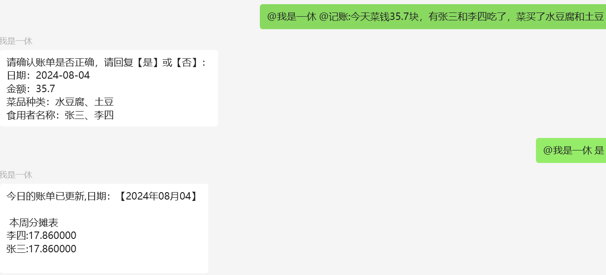

# AccountingWeChatRobot

一个用于微信每日支出记账机器人，用于组团买菜群聊统计分配支出。
效果如下图：


## 使用方法

1. 添加机器人到群聊中。
1. @机器人，添加命令，例如：`@机器人 @记账:今日消费143元，买了白菜和胡萝卜，张三和王五吃`
   > 机器人会利用 AI 识别出消费金额，并记录到数据库中。
   > 也可食用`@机器人 @查账:`命令来获取每人分摊的金额。
   > 每天只会产生于一条记录，重复创建会覆盖当天的旧记录。

## 部署

数据库采用`sqlite`，无需部署。

> git clone https://github.com/xiuyusheng/AccountingWeChatRobot.git

### windows

打开 cmd，执行`build`命令，再执行`main.exe`即可。

```cmd
go build main.go && main.exe
```

或者测试直接`run`

```cmd
go run main.go
```

### linux

在 windows 上打包 linux 可执行文件，然后执行即可。

```sh
set CGO_ENABLED=0
set GOOS=linux
set GOARCH=amd64
go build -o main-linux main.go
```

再将`main-linux`文件[storage.json](./storage.json)放到 linux 服务器上，并在当前目录下执行`chmod`来赋予权限。

```sh
chmod a+x main-linux
```

运行即可。
